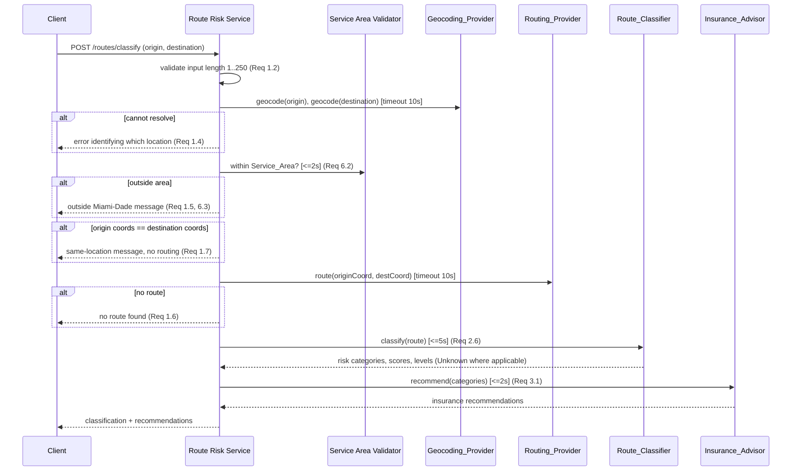
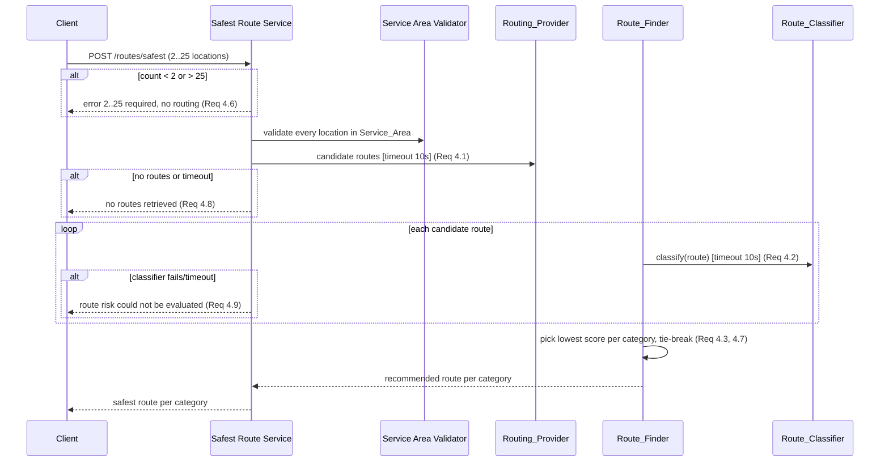

# Design Document

## Overview

The Route Risk Advisor is a Spring Boot (Java 17) application that classifies the risk of driving routes within Miami-Dade County, Florida and recommends appropriate car insurance coverage. It exposes a small REST API and is built with Maven and tested with JUnit 5.

The application delivers two user-facing capabilities:

1. **Route Risk Classification** — resolve an origin/destination pair into a `Route`, score it across the Accident, Theft, and Fire risk categories, and recommend insurance types based on those scores.
2. **Safest Route Finder** — given 2–25 locations, request candidate routes, score each, and return the lowest-risk route per category with defined tie-breaking rules.

The central design principle for this version is a **provider abstraction layer**. All external data access (geocoding, routing, crash, crime, fire) is defined behind five interfaces. This first version ships **only placeholder (mock) implementations** that return realistic Miami-Dade sample data with no network calls. Real implementations (Google Maps, Mapbox, ORS, FLHSMV/NHTSA FARS/FDOT, Socrata/ArcGIS open data, city fire datasets) are documented as future work and can be swapped in via configuration without touching `Route_Classifier`, `Route_Finder`, or `Insurance_Advisor`.

### Design Goals

- **Substitutability:** swapping a placeholder for a real provider is a configuration change, never a source change to the domain/service logic.
- **Graceful degradation:** provider timeouts or missing data downgrade a category to `Unknown` rather than failing the whole classification (per Requirement 2), while the multi-route comparison aborts cleanly on failure (per Requirement 4).
- **Scoped correctness:** every request is validated against the `Service_Area` (Miami-Dade County) before processing.
- **Deterministic placeholders:** placeholder providers return stable, reproducible sample data so behavior and tests are predictable.

### Key Design Decisions

| Decision | Rationale |
|---|---|
| Spring Boot + REST | Idiomatic Java; dependency injection makes configuration-based provider selection natural. |
| Provider selection via Spring configuration + `@ConditionalOnProperty` | Satisfies Requirement 5: choose implementation per interface through config; fail startup fast if unresolved. |
| Risk score as integer 0–100 | Matches Requirement 2.4 exactly; simple to reason about and to threshold into Low/Medium/High. |
| Per-provider timeouts enforced at the service layer | Requirements specify distinct timeouts (10s geocoding/routing, 5s classification providers). Enforced with bounded async execution. |
| `Unknown` modeled as a first-class risk level | Requirement 2.7–2.9 requires distinguishing "no data / provider failed" from an actual low score. |

## Architecture

The application is layered: a thin REST/controller layer, an application service layer that orchestrates the two features, a domain layer holding the scoring and selection logic, and a provider abstraction layer that isolates all external data access.

```mermaid
graph TD
    Client[REST Client] --> API[REST Controllers]

    subgraph Application Services
        RouteRiskService[Route Risk Service]
        SafestRouteService[Safest Route Service]
    end

    API --> RouteRiskService
    API --> SafestRouteService

    subgraph Domain
        ServiceAreaValidator[Service Area Validator]
        RouteClassifier[Route_Classifier]
        RouteFinder[Route_Finder]
        InsuranceAdvisor[Insurance_Advisor]
        RiskScorer[Risk Scorer]
    end

    RouteRiskService --> ServiceAreaValidator
    RouteRiskService --> RouteClassifier
    RouteRiskService --> InsuranceAdvisor
    SafestRouteService --> ServiceAreaValidator
    SafestRouteService --> RouteFinder
    RouteFinder --> RouteClassifier
    RouteClassifier --> RiskScorer

    subgraph Provider Abstraction Layer
        GP[Geocoding_Provider]
        RP[Routing_Provider]
        CrashP[Crash_Data_Provider]
        CrimeP[Crime_Data_Provider]
        FireP[Fire_Data_Provider]
    end

    RouteRiskService --> GP
    RouteRiskService --> RP
    SafestRouteService --> RP
    RiskScorer --> CrashP
    RiskScorer --> CrimeP
    RiskScorer --> FireP

    subgraph Placeholder Implementations (this version)
        GPImpl[Placeholder Geocoding]
        RPImpl[Placeholder Routing]
        CrashImpl[Placeholder Crash]
        CrimeImpl[Placeholder Crime]
        FireImpl[Placeholder Fire]
    end

    GP -.selected by config.-> GPImpl
    RP -.selected by config.-> RPImpl
    CrashP -.selected by config.-> CrashImpl
    CrimeP -.selected by config.-> CrimeImpl
    FireP -.selected by config.-> FireImpl

    subgraph Future (not implemented)
        RealMap[Google/Mapbox/ORS]
        RealCrash[FLHSMV/NHTSA FARS/FDOT]
        RealCrime[Miami-Dade/City Socrata/ArcGIS]
        RealFire[City Fire Datasets]
    end

    GP -.future.-> RealMap
    RP -.future.-> RealMap
    CrashP -.future.-> RealCrash
    CrimeP -.future.-> RealCrime
    FireP -.future.-> RealFire
```

### Route Risk Classification Flow



### Safest Route Finder Flow



## Components and Interfaces

### Provider Abstraction Layer

All five providers are Java interfaces. Each has exactly one placeholder implementation in this version. Selection is by configuration (see Configuration Strategy). Providers never leak network/transport concerns into the domain layer; they return plain domain records or throw a `ProviderException` (which includes timeout/failure signaling).

```java
public interface GeocodingProvider {
    // Returns coordinates for a free-text location, or empty if it cannot be resolved.
    Optional<GeoCoordinate> geocode(String locationDescription) throws ProviderException;
}

public interface RoutingProvider {
    // One route between two points (used by classification).
    Optional<Route> route(GeoCoordinate origin, GeoCoordinate destination) throws ProviderException;

    // Candidate routes connecting an ordered list of points (used by safest-route finder).
    // Returned list preserves provider order; the index is the tie-break "earliest returned" key.
    List<Route> candidateRoutes(List<GeoCoordinate> orderedPoints) throws ProviderException;
}

public interface CrashDataProvider {
    // Accident data for a segment; empty means "no data for this segment" (Req 2.7).
    Optional<RiskObservation> crashData(RouteSegment segment) throws ProviderException;
}

public interface CrimeDataProvider {
    Optional<RiskObservation> theftData(RouteSegment segment) throws ProviderException;
}

public interface FireDataProvider {
    Optional<RiskObservation> fireData(RouteSegment segment) throws ProviderException;
}
```

`RiskObservation` is the common per-segment record returned by the three risk-data providers: a normalized intensity value the scorer aggregates into a 0–100 `Risk_Score`.

```java
public record RiskObservation(
    RouteSegment segment,
    double normalizedIntensity, // 0.0..1.0, provider-normalized incident density
    int sampleCount             // number of underlying incidents represented
) {}
```

### Domain Services

**Service_Area Validator** — determines whether a `GeoCoordinate` falls within Miami-Dade County. See Service_Area Boundary Checking below.

**Route_Classifier** — for a resolved `Route`, computes a `Risk_Score` and risk level per category. Orchestrates the three risk-data providers per segment, aggregates to route level, applies `Unknown` rules, and enforces the 5-second budget.

```java
public interface RouteClassifier {
    RouteClassification classify(Route route); // Req 2; never throws for provider failure — degrades to Unknown
}
```

**Insurance_Advisor** — maps classified categories to insurance recommendations.

```java
public interface InsuranceAdvisor {
    InsuranceRecommendationResult recommend(RouteClassification classification); // Req 3
}
```

**Route_Finder** — compares candidate routes and selects the lowest-risk per category with tie-breaking.

```java
public interface RouteFinder {
    SafestRouteResult findSafest(List<Route> candidateRoutes); // Req 4
}
```

### REST Controllers

- `POST /api/routes/classify` — body `{ origin, destination }`; returns classification + insurance recommendations, or a structured error.
- `POST /api/routes/safest` — body `{ locations: [...] }`; returns the safest route per category, or a structured error.

Errors are returned as a consistent JSON envelope with an error code, a human-readable message, and (where applicable) the offending field. HTTP status maps: 400 for validation/business rejections (invalid input, out of area, same location, too few/many locations), 404 for no route found, 503 for provider timeouts/unavailability.

### Risk Scoring Approach

The `Risk_Scorer` converts provider observations into a route-level `Risk_Score` per category:

1. For each `Route_Segment`, request the relevant provider observation.
2. If the provider returns empty for a segment, that segment's category is `Unknown` (Req 2.7).
3. If the provider times out (5s) or fails for the route, the whole category is `Unknown` and other categories continue (Req 2.9).
4. Aggregate the segment intensities that are present into a single route intensity using a **distance-weighted mean** of `normalizedIntensity` (longer segments influence the score proportionally). This yields a value in `[0.0, 1.0]`.
5. Map to an integer score: `score = round(intensity * 100)`, clamped to `[0, 100]` (Req 2.4).
6. If **every** segment for a category is `Unknown`, the category is reported as `Unknown` with no score (Req 2.8).
7. Assign level from score: `0–33 Low`, `34–66 Medium`, `67–100 High` (Req 2.5).

Distance-weighted mean is chosen (over a plain mean or max) because a route's category risk should reflect the exposure along its length; a short high-risk segment should not dominate a long low-risk route, and vice versa. This keeps scores monotonic and bounded, which supports the correctness properties below.

### Safest Route Selection and Tie-Breaking

For each `Risk_Category`, `Route_Finder`:

1. Considers only candidate routes whose category is scored (not `Unknown`) — a route with `Unknown` for a category cannot be proven lowest for it. If all candidates are `Unknown` for a category, that category's recommendation is reported as `Unknown`.
2. Selects the minimum `Risk_Score`.
3. **Tie-break 1:** if multiple routes share the lowest score, pick the shorter total distance (Req 4.7).
4. **Tie-break 2:** if distances are also equal, pick the route with the smallest provider index (earliest returned) (Req 4.7).
5. If only one candidate route exists, it is returned for every category (Req 4.5).

### Configuration Strategy (Provider Selection)

Each interface has a configuration key selecting its implementation. In this version the only registered implementation per interface is the placeholder, and it is the default.

```yaml
route-risk-advisor:
  service-area:
    county: "Miami-Dade"
    state: "FL"
  providers:
    geocoding: placeholder   # future: google | mapbox | ors
    routing:   placeholder   # future: google | mapbox | ors
    crash:     placeholder   # future: flhsmv | nhtsa-fars | fdot
    crime:     placeholder   # future: miami-dade-socrata | arcgis
    fire:      placeholder   # future: city-fire
  timeouts:
    geocoding-ms: 10000
    routing-ms:   10000
    provider-ms:  5000
    classify-ms:  5000
    recommend-ms: 2000
    service-area-ms: 2000
    safest-classify-ms: 10000
```

Implementation binding uses Spring `@ConditionalOnProperty` so exactly one bean is registered per interface. At startup, a validator confirms that each of the five interfaces resolves to exactly one instantiable bean; if a configured implementation name cannot be resolved, startup halts with an error naming the interface and the unresolved implementation (Req 5.7). Because the domain services depend only on the interfaces, changing a provider requires no source change to `Route_Classifier`, `Route_Finder`, or `Insurance_Advisor` (Req 5.6).

## Data Models

```java
public record GeoCoordinate(double latitude, double longitude) {}

public record RouteSegment(
    String id,
    GeoCoordinate start,
    GeoCoordinate end,
    double distanceMeters
) {}

public record Route(
    String id,
    int providerIndex,              // order returned by Routing_Provider (tie-break key, Req 4.7)
    List<RouteSegment> segments,
    double totalDistanceMeters
) {}

public enum RiskCategory { ACCIDENT, THEFT, FIRE, OTHER }

public enum RiskLevel { LOW, MEDIUM, HIGH, UNKNOWN }

// A category result: either a scored value with a level, or Unknown (score absent).
public record RiskAssessment(
    RiskCategory category,
    Integer score,        // 0..100, null when level == UNKNOWN (Req 2.8)
    RiskLevel level
) {}

public record RouteClassification(
    Route route,
    List<RiskAssessment> assessments   // one per ACCIDENT, THEFT, FIRE
) {}

public enum InsuranceType {
    LIABILITY_BASELINE,          // Req 3.5
    COLLISION_COVERAGE,          // Accident, Req 3.2
    COMPREHENSIVE_THEFT_COVERAGE,// Theft,    Req 3.3
    COMPREHENSIVE_FIRE_COVERAGE  // Fire,     Req 3.4
}

public record InsuranceRecommendation(
    InsuranceType insuranceType,
    List<RiskJustification> justifiedBy   // category name + risk level (Req 3.6)
) {}

public record RiskJustification(RiskCategory category, RiskLevel level) {}

public enum RecommendationStatus { PRODUCED, NONE_PRODUCED }  // Req 3.7

public record InsuranceRecommendationResult(
    List<InsuranceRecommendation> recommendations,
    RecommendationStatus status,
    List<RiskAssessment> receivedAssessments  // retained unchanged, Req 3.7
) {}

public record CategoryRecommendation(
    RiskCategory category,
    Route recommendedRoute,   // null only when all candidates Unknown for this category
    Integer score,            // score of recommendedRoute for this category
    RiskLevel level
) {}

public record SafestRouteResult(List<CategoryRecommendation> perCategory) {}
```

### Insurance Mapping Rules

| Risk_Category | Level Medium/High → Insurance_Type |
|---|---|
| Accident | `COLLISION_COVERAGE` (Req 3.2) |
| Theft | `COMPREHENSIVE_THEFT_COVERAGE` (Req 3.3) |
| Fire | `COMPREHENSIVE_FIRE_COVERAGE` (Req 3.4) |

If **all** categories are `Low`, recommend exactly one `LIABILITY_BASELINE` and nothing else (Req 3.5). `Unknown` categories do not produce a recommendation. If the received set is empty or maps to nothing (e.g., all `Unknown`), return an empty recommendation set with status `NONE_PRODUCED`, retaining the received assessments unchanged (Req 3.7).

### Service_Area Boundary Checking

Miami-Dade County is represented as a polygon (a bounding polygon of the county boundary, refined from the county's published GeoJSON as future work; a conservative bounding box plus a coarse polygon is used for the placeholder version). `ServiceAreaValidator.contains(GeoCoordinate)` performs a point-in-polygon test and returns within a 2-second budget (Req 6.2). Any coordinate outside the polygon is rejected with the Miami-Dade-only message (Req 1.5, 6.3). Placeholder providers only ever emit coordinates inside this polygon (Req 6.6).

### Placeholder Data Design

Each placeholder provider returns deterministic Miami-Dade sample data:

- **Placeholder Geocoding** — maps a curated set of Miami-Dade place names/addresses (e.g., Downtown Miami, Miami Beach, Coral Gables, Hialeah, Kendall) to real in-county coordinates; unknown inputs resolve deterministically to a nearby in-county coordinate or return empty to exercise the "cannot resolve" path.
- **Placeholder Routing** — synthesizes 1–N routes between points as connected segments with plausible Miami-Dade distances; produces multiple candidates for the safest-route flow, each with a stable `providerIndex`.
- **Placeholder Crash / Crime / Fire** — return `RiskObservation`s keyed off segment geography with stable pseudo-random-but-reproducible intensities, so scores are deterministic per segment. Some segments deliberately return empty to exercise the `Unknown` paths.

## Correctness Properties

*A property is a characteristic or behavior that should hold true across all valid executions of a system — essentially, a formal statement about what the system should do. Properties serve as the bridge between human-readable specifications and machine-verifiable correctness guarantees.*

The following properties were derived from the acceptance criteria after a prework testability analysis and a redundancy-elimination reflection (e.g., the Service_Area criteria 1.5/6.2/6.3/6.4 collapse into a single containment property; the insurance mapping criteria 3.1–3.4 collapse into one mapping property; the selection and tie-break criteria 4.3/4.4/4.5/4.7 collapse into one ordering property).

### Property 1: Input validation accepts iff within bounds

*For any* origin and destination strings, the classification submission is accepted and forwarded to geocoding if and only if each string, after trimming, is non-empty and at most 250 characters; when rejected, the error identifies exactly the invalid location(s), previously entered values are retained, and no stored data is altered.

**Validates: Requirements 1.1, 1.2, 6.5**

### Property 2: Resolution failure identifies the failing location

*For any* pair of locations where one or both cannot be resolved to coordinates by the Geocoding_Provider, the returned error identifies exactly the location(s) that could not be resolved.

**Validates: Requirements 1.4**

### Property 3: Identical coordinates short-circuit routing

*For any* geographic coordinate used as both origin and destination, the Route_Risk_Advisor returns the same-location message and never requests a Route from the Routing_Provider.

**Validates: Requirements 1.7**

### Property 4: Service_Area containment governs acceptance

*For any* resolved coordinate, the request proceeds if and only if the coordinate lies within the Miami-Dade County Service_Area polygon; a coordinate outside the polygon is rejected with the Miami-Dade-only message and no Route is requested.

**Validates: Requirements 1.5, 6.2, 6.3, 6.4**

### Property 5: Risk scores are bounded integers

*For any* Route and any set of provider observations, every produced Risk_Score is an integer in the inclusive range 0 to 100.

**Validates: Requirements 2.4**

### Property 6: Score maps to the correct risk level

*For any* integer Risk_Score in 0 to 100, the assigned risk level is Low when the score is 0–33, Medium when 34–66, and High when 67–100.

**Validates: Requirements 2.5**

### Property 7: Unknown aggregation and category completeness

*For any* resolved Route, the classification returns an assessment for each of the Accident, Theft, and Fire categories, and a category is reported as Unknown with no score if and only if every Route_Segment lacked data for that category; otherwise the category has a bounded numeric score computed only from the segments that returned data.

**Validates: Requirements 2.6, 2.7, 2.8**

### Property 8: Provider failure is isolated to its category

*For any* subset of the crash, crime, and fire providers that fail or time out, the corresponding categories are reported as Unknown while every non-failing category still produces a scored assessment.

**Validates: Requirements 2.9**

### Property 9: Insurance mapping for Medium and High categories

*For any* RouteClassification, the set of recommended Insurance_Types equals exactly the set obtained by mapping each category at Medium or High level through the fixed table: Accident → collision coverage, Theft → comprehensive theft coverage, Fire → comprehensive fire coverage.

**Validates: Requirements 3.1, 3.2, 3.3, 3.4**

### Property 10: All-Low routes recommend a single baseline liability

*For any* RouteClassification in which every category has a Low risk level, the recommendation set consists of exactly one baseline liability Insurance_Type and no other Insurance_Type.

**Validates: Requirements 3.5**

### Property 11: Every recommendation is justified

*For any* produced recommendation set, each recommended Insurance_Type carries at least one justifying Risk_Category, and every justifying category has a Medium or High level and maps to that Insurance_Type under the mapping table.

**Validates: Requirements 3.6**

### Property 12: Unmappable input yields none-produced with input retained

*For any* RouteClassification that contains no Medium/High category and is not an all-Low classification (i.e., empty or entirely Unknown), the Insurance_Advisor returns an empty recommendation set with status NONE_PRODUCED and returns the received assessments unchanged.

**Validates: Requirements 3.7**

### Property 13: Location count validation

*For any* list of submitted locations, the Route_Finder requests candidate Routes if and only if the count is between 2 and 25 inclusive; otherwise it rejects the request with the "between 2 and 25 locations" message and does not request candidate Routes.

**Validates: Requirements 4.1, 4.6**

### Property 14: Safest route is the minimum under the tie-break order

*For any* set of candidate Routes with computed Risk_Scores, the route recommended for a category is the minimum under lexicographic ordering by (Risk_Score, total distance, provider index); consequently, when only one candidate exists it is recommended for every category.

**Validates: Requirements 4.3, 4.4, 4.5, 4.7**

### Property 15: Comparison aborts atomically without partial results

*For any* safest-route comparison in which the Routing_Provider returns no candidates (or fails) or the Route_Classifier fails for any candidate Route, the result is an error and contains no recommendation for any category.

**Validates: Requirements 4.8, 4.9**

### Property 16: Placeholder output is valid and in-area

*For any* input to a Placeholder_Provider, every returned record conforms to the field structure of its Data_Provider interface (required fields present and within valid ranges) and every geographic coordinate it references lies within the Service_Area.

**Validates: Requirements 5.3, 6.6**

## Error Handling

Errors fall into three classes, each with a distinct handling strategy and HTTP mapping.

**1. Validation and business rejections (client error, HTTP 400).**
Returned before or without invoking external providers. Rejections are pure — they never mutate stored state (Req 6.5).
- Invalid input length/blankness → error naming the invalid field, prior values retained (Req 1.2).
- Location outside Service_Area → Miami-Dade-only message (Req 1.5, 6.3).
- Identical origin/destination → same-location message, routing skipped (Req 1.7).
- Fewer than 2 or more than 25 locations → count message, routing skipped (Req 4.6).

**2. Resource-not-found (HTTP 404).**
- Location cannot be geocoded → error naming the unresolved location (Req 1.4).
- No Route returned by Routing_Provider → no-route message (Req 1.6).

**3. Provider unavailability (server/dependency error, HTTP 503) and graceful degradation.**
Two different policies apply depending on the feature:
- **Classification (single route):** if a risk-data provider times out (5s) or fails, only that category degrades to `Unknown`; the remaining categories are still computed and returned (Req 2.9). This is degradation, not failure.
- **Geocoding/Routing during classification:** a 10s timeout or failure aborts the request with a "temporarily unavailable" message (Req 1.8), because without coordinates or a route there is nothing to classify.
- **Safest-route comparison:** any missing/failed candidate routes (Req 4.8) or any classifier failure/timeout (10s) for any candidate (Req 4.9) aborts the entire comparison with no partial recommendation. Partial safest-route results would be misleading, so the operation is all-or-nothing (Property 15).

**Timeout enforcement.** Each provider call is executed with a bounded wait using the configured budget. A `ProviderException` carries whether the cause was a timeout or a failure response so the service layer applies the correct policy (degrade vs. abort). Timeouts are enforced at the service layer so placeholder and future real providers share identical timeout semantics.

**Startup/configuration errors.** If a configured provider implementation cannot be resolved or instantiated for an interface, startup halts with an error naming the interface and the unresolved implementation; no route request is processed (Req 5.7).

**Error envelope.** All API errors share one JSON shape: `{ code, message, field? }` — where `code` is a stable machine-readable identifier (e.g., `INVALID_INPUT`, `OUT_OF_SERVICE_AREA`, `SAME_LOCATION`, `NO_ROUTE`, `SERVICE_UNAVAILABLE`, `LOCATION_COUNT_OUT_OF_RANGE`, `ROUTE_RISK_UNEVALUATED`) and `field` names the offending input when applicable.

## Testing Strategy

The strategy combines property-based tests (universal correctness), example/unit tests (specific behaviors and branches), integration tests (provider wiring, timeouts, startup), and architecture tests (the abstraction constraint). Property-based testing is appropriate here because the core logic — risk scoring, level bands, insurance mapping, safest-route selection/tie-breaking, service-area containment, and placeholder validity — consists of pure functions with clear inputs and universal properties across large input spaces.

### Property-Based Testing

- **Library:** jqwik (JUnit 5 property-based testing library for Java). Properties are not implemented from scratch.
- **Iterations:** each property test runs a minimum of 100 generated cases.
- **Traceability:** each property test is tagged with a comment in the format
  `// Feature: route-risk-advisor, Property {number}: {property_text}` and references the design property it implements.
- **Coverage:** each of the 16 correctness properties above is implemented by exactly one property-based test.
- **Generators:**
  - `GeoCoordinate` generators for in-polygon and out-of-polygon Miami-Dade coordinates (to drive Property 4, 16).
  - `Route`/`RouteSegment` generators with varying segment counts, distances, and per-segment "has data / no data" flags (Properties 5, 7).
  - `RiskObservation` generators over `[0.0, 1.0]` intensity and sample counts (Properties 5, 7).
  - Score generators over `0..100` (Property 6).
  - `RouteClassification` generators spanning all-Low, mixed Medium/High, all-Unknown, and empty (Properties 9–12).
  - Candidate-route-set generators with deliberately colliding scores and distances to exercise tie-breaking (Property 14).
  - String generators across boundary lengths (0, 1, 250, 251) and whitespace-only content (Property 1).
  - Provider-failure subset generators over `{crash, crime, fire}` (Property 8).
  - Location-count generators over `0..40` (Property 13).

### Unit / Example Tests

Focused example tests cover specific branches and orchestration that do not vary meaningfully with input:
- Routing requested once both locations geocode (Req 1.3).
- No-route branch returns the no-route message (Req 1.6).
- Classifier draws Accident/Theft/Fire from the crash/crime/fire providers respectively (Req 2.1–2.3).
- Route_Finder invokes the classifier once per candidate route (Req 4.2).
- Boundary examples for score→level at 33/34 and 66/67, and mapping examples Accident→collision, Theft→theft, Fire→fire (reinforcing Properties 6, 9).

### Integration Tests

- **Timeouts:** mock providers that exceed the 10s (geocoding/routing, safest classify) and 5s (risk-data) budgets or return failures; assert the abort vs. degrade policies (Req 1.8, 2.9, 4.8, 4.9). Timing is asserted with a mock that signals delay rather than sleeping the full duration where possible.
- **Provider selection:** default config routes to placeholders (Req 5.5); a stub "real" implementation configured for an interface receives the calls and the placeholder is not invoked (Req 5.4).
- **Startup validation:** a configuration referencing an unresolvable implementation causes startup to fail with an error naming the interface and implementation (Req 5.7).
- **End-to-end:** placeholder-backed happy paths for `POST /api/routes/classify` and `POST /api/routes/safest` returning within their time budgets (Req 2.6, 3.1, 6.2).

### Smoke Tests

- A placeholder bean exists for each of the five provider interfaces (Req 5.2).
- The configured Service_Area resolves to Miami-Dade County, Florida (Req 6.1).

### Architecture Tests

- An ArchUnit rule asserts that `Route_Classifier`, `Route_Finder`, `Insurance_Advisor`, and the risk scorer depend only on the provider interfaces and never on concrete provider implementations, enforcing the abstraction constraint and configuration-only substitutability (Req 5.1, 5.6).

## Future Work: Real Data Provider Integration

These are documented targets only and are **not implemented** in this version. Each is a drop-in implementation of an existing provider interface, selected via configuration with no change to the domain services.

- **Geocoding / Routing (`Geocoding_Provider`, `Routing_Provider`):** Google Maps Platform, Mapbox, or OpenRouteService (ORS).
- **Crash data (`Crash_Data_Provider`):** FLHSMV crash statistics, NHTSA FARS Crash API, and/or FDOT crash datasets.
- **Crime/theft data (`Crime_Data_Provider`):** Miami-Dade County and City of Miami open data via the Socrata SODA API and ArcGIS feature services.
- **Fire incident data (`Fire_Data_Provider`):** city fire department incident datasets.

Real implementations will add transport concerns (HTTP clients, auth/keys, rate limiting, response mapping, and retry/backoff) internally while continuing to honor the same interface contracts, timeout semantics, and `ProviderException` failure signaling used by the placeholders.
